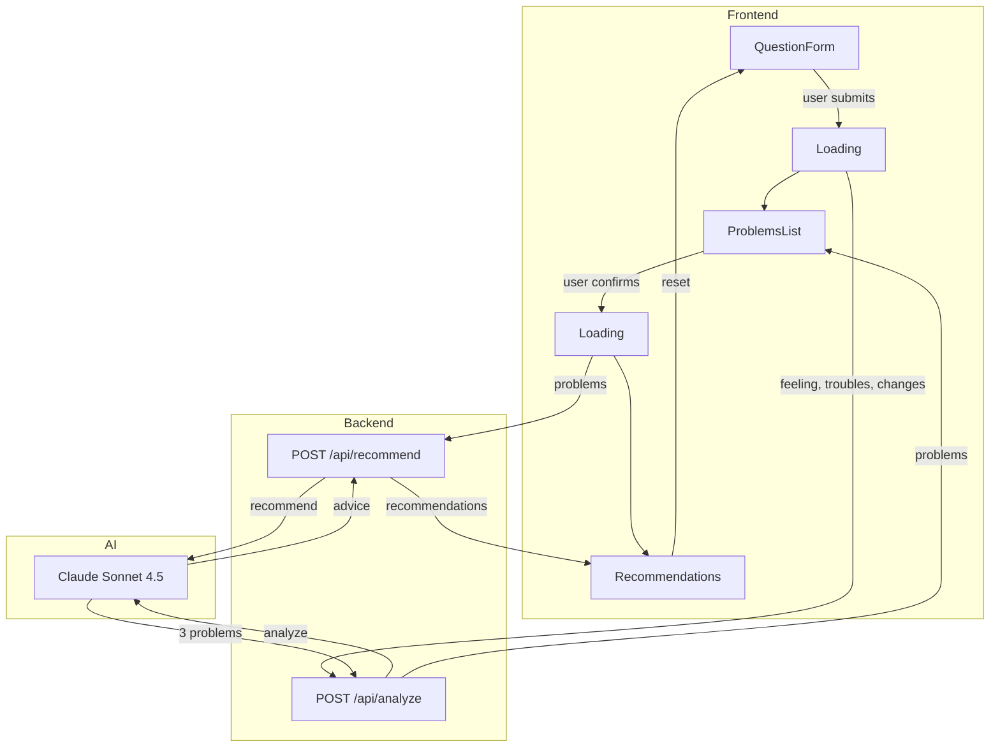

# Life Coach App

AI-powered life coaching assistant that helps you identify problems and get personalized recommendations.

## Prerequisites

- Python 3.11+
- Node.js 18+
- Anthropic API key ([get one here](https://console.anthropic.com/))

## Setup

### Backend

```bash
cd backend
python -m venv .venv
source .venv/bin/activate  # Windows: .venv\Scripts\activate
pip install -r requirements.txt
```

Create `.env` file:
```bash
ANTHROPIC_API_KEY=your-api-key-here
```

### Frontend

```bash
cd frontend
npm install
cp .env.local.example .env.local
```

The `.env.local` should contain:
```bash
NEXT_PUBLIC_API_URL=http://localhost:8000
```

## Running

### Start Backend (port 8000)

```bash
cd backend
source .venv/bin/activate
uvicorn main:app --reload --port 8000
```

### Start Frontend (port 3000)

```bash
cd frontend
npm run dev
```

Open http://localhost:3000

## How It Works



### User Flow

1. **QuestionForm** - Answer 3 questions about how you feel
2. **ProblemsList** - AI identifies 3 main problems, confirm them
3. **Recommendations** - Get personalized advice for each problem

## Tech Stack

- **Backend:** FastAPI, Python, Claude Sonnet 4.5 (structured outputs)
- **Frontend:** Next.js 14, TypeScript, Tailwind CSS

## Tests

```bash
cd backend
pytest -v
```
